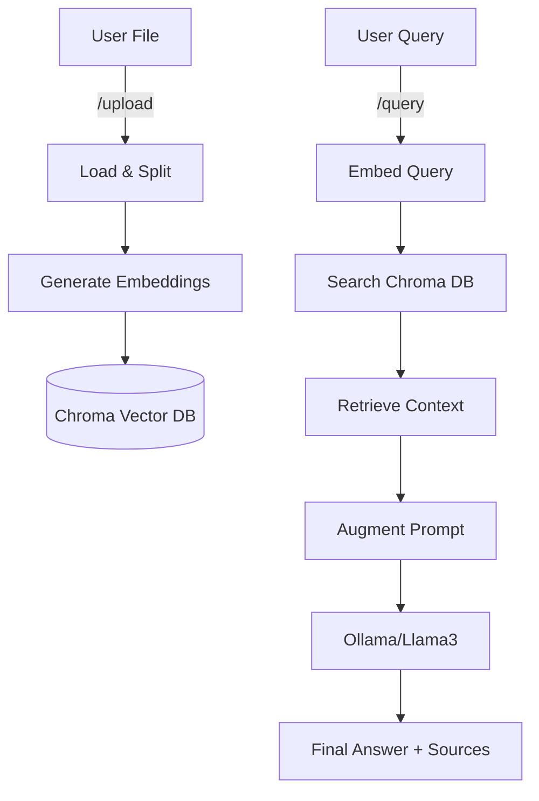

Listed directory RAG-CHATBOAT
Listed directory app
Viewed routes.py:1-83
Viewed document_processor.py:1-35
Viewed chroma_store.py:1-42
Viewed rag_service.py:1-65

Based on the codebase of your RAG project, here is the detailed technical workflow for the two main endpoints:

---

### 1. Workflow for `/upload`
This workflow is responsible for transforming raw files into searchable mathematical vectors (embeddings).

1.  **Request Received**: FastAPI receives the file via `UploadFile`. It validates the format (PDF, TXT, or MD).
2.  **Disk Storage**: The file is temporarily saved to the local `data/uploads` directory.
3.  **Document Loading**: The `DocumentProcessor` identifies the file type and uses a specific **LangChain Loader** (e.g., `PyPDFLoader` for PDFs) to extract the raw text.
4.  **Text Splitting (Chunking)**: 
    *   Since LLMs have a "context window" limit, the extracted text is broken into smaller chunks using `RecursiveCharacterTextSplitter`. 
    *   *Settings:* Chunks are typically ~1000 characters with a small overlap to ensure no context is lost at the boundaries.
5.  **Embedding Generation**: Each text chunk is passed through the **HuggingFace Embedding Model** (`all-MiniLM-L6-v2`). This converts the human text into a list of numbers (a vector) that represents its semantic meaning.
6.  **Vector Storage**: The vectors, along with the original text and metadata (like filename), are saved into the **Chroma DB** (your vector store).
7.  **Response**: The API returns a success message and the total count of indexed chunks.

---

### 2. Workflow for `/query`
This workflow follows the standard **RAG (Retrieval-Augmented Generation)** pattern.

1.  **Request Received**: The user sends a JSON object containing their question (e.g., `{"query": "What is the company policy?"}`).
2.  **Retrieval Phase**:
    *   The user's query is converted into a vector using the same embedding model used during upload.
    *   The system performs a **Similarity Search** in Chroma DB to find the top `k` chunks (context) most relevant to the question.
    *   *Search Logic:* It uses **MMR (Maximum Marginal Relevance)** to ensure the retrieved chunks are both relevant and diverse (not repetitive).
3.  **Prompt Construction**: 
    *   The `rag_service` takes the retrieved chunks and the user's question and "stuffs" them into a **System Prompt Template**.
    *   *Current Persona:* Your system is currently configured with a "Pirate Captain" persona, which tells the LLM to answer using pirate slang while strictly sticking to the retrieved context.
4.  **LLM Generation**:
    *   The complete prompt (Context + Question + Instructions) is sent to the LLM (currently **Ollama running Llama3**).
    *   The LLM generates a human-like response based *only* on the provided context.
5.  **Response Generation**:
    *   The system extracts the text answer and the metadata of the source documents.
    *   **Final Output**: You receive a JSON response containing the `answer` and a list of `sources` (snippets of the actual files used to generate the answer).

---

### Summary Diagram
